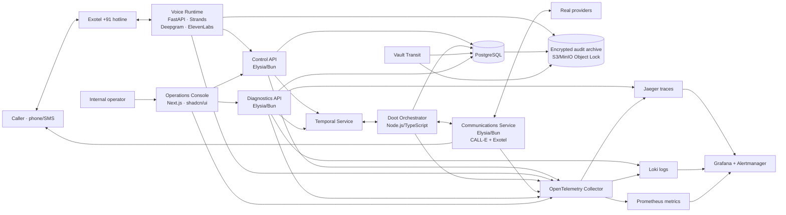

# Doot System Design

## 1. Summary

Doot will be a hotline-first coordination platform built around the authoritative workflow:

`discover → validate → hold → one human decision → commit → release alternatives`

The architecture will use:

- TypeScript/Elysia on Bun for APIs and communications adapters.
- A Node.js Temporal worker for durable orchestration; Temporal’s TypeScript SDK officially supports Node rather than Bun.
- Python/FastAPI with Strands Agents for real-time intake, negotiation policy, and voice intelligence.
- Next.js App Router with shadcn/ui for an internal operations console. Callers continue to interact only by voice and SMS.
- Exotel for the India-first +91 hotline, Deepgram Flux multilingual for Hinglish streaming recognition and endpointing, ElevenLabs conversational TTS, CALL-E for outbound provider calls and caller callbacks, and Bedrock-hosted models through Strands.
- A cloud-agnostic Docker Compose → Kubernetes deployment path.
- OpenTelemetry Collector, Jaeger, Loki, Prometheus, Grafana, Alertmanager, and a restricted local Dozzle instance as dedicated observability services.

CALL-E currently exposes outbound Calls and Goal Runs but no inbound Developer API. Therefore Exotel must own inbound media while CALL-E remains the essential outbound negotiation mechanism. CALL-E supports India in English, Hindi, and Tamil, although India calls currently use international lines intended primarily for testing.[^2][^3]



## 2. Architecture and Behavior

### Application services

1. **Control API — Elysia/Bun**
   - Owns cases, providers, holds, consents, audit metadata, authenticated operations APIs, and webhook ingress.
   - Generates a UUIDv7 `request_id` at every ingress and starts or continues the W3C trace context.
   - Validates every payload from Exotel and CALL-E before placing it in an idempotent webhook inbox.
   - Is the only application service allowed to write authoritative business records.

2. **Doot Orchestrator — Temporal TypeScript worker on Node.js 24**
   - Runs one durable `CaseWorkflow` per case with child workflows for provider calls, caller callback, expiry, releases, and post-commit confirmation.
   - Uses durable timers for hold expiry and Signals for provider results, caller decisions, manual intervention, and cancellation.
   - Survives worker restarts and external timeouts without reconstructing state from logs. Temporal is specifically designed for resumable, long-running execution.[^4]
   - Keeps Temporal as an execution ledger, while PostgreSQL remains the queryable business source of truth.

3. **Voice Runtime — FastAPI/Python**
   - Terminates Exotel’s authenticated WebSocket media stream.
   - Sends 8 kHz PCM to Deepgram `flux-general-multi` with Hindi and English language hints. Flux supplies multilingual, interruption-aware endpointing suitable for code-switching.[^5]
   - Streams responses through ElevenLabs `eleven_v3_conversational`, interrupting output immediately on barge-in.[^6]
   - Runs Strands with two pinned model profiles:
     - Fast intake/classification: `anthropic.claude-haiku-4-5`.
     - Negotiation planning and option synthesis: `anthropic.claude-sonnet-4-6`.
   - Treats the LLM as a proposal generator. Deterministic policies retain authority over safety routing, eligibility representation, hold status, expiry, commit, and release.
   - Emits Strands’ native OpenTelemetry agent/model/tool spans, but excludes reasoning text and personal data from standard telemetry.[^7]

4. **Communications Service — Elysia/Bun**
   - Wraps the CALL-E TypeScript SDK and Exotel messaging APIs behind typed internal commands.
   - Uses published CALL-E Goal Runs for repeatable provider-hold, release, caller-decision, and confirmation workflows. One-shot Calls remain limited to authorized tests and unusual tasks.
   - Starts provider Goal Runs individually and concurrently so every provider has an independent timeout, idempotency key, result, and trace correlation.
   - Sends the structured comparison SMS after the callback and handles delivery receipts.

5. **Diagnostics API — Elysia/Bun**
   - Provides bounded, deterministic troubleshooting views instead of asking an AI to read thousands of log lines.
   - Joins case state, Temporal status, external-call attempts, failed spans, and correlated error logs into a sanitized support bundle.
   - Never performs state changes and cannot retrieve raw audio or full transcripts without an explicit auditor-only request.

6. **Operations Console — Next.js**
   - Internal-only surface for operators, supervisors, developers, and auditors.
   - Uses server components for read-heavy pages and small client components for SSE-powered live status, countdowns, and intervention controls.
   - Uses Next.js server instrumentation to emit OpenTelemetry data.[^8]

### Workflow semantics

The case state machine is:

`intake → safety_screened → searching → validating → awaiting_decision → committing → releasing → resolved`

Terminal or exceptional states are:

`safety_handoff`, `no_options`, `expired`, `manual_review`, and `failed`.

The workflow must enforce these rules:

- Speak AI disclosure, recording notice, purpose, retention, and deletion instructions before collecting the request.
- Run the emergency safety gate before mode selection and continuously monitor later turns for an escalation trigger.
- Classify the case as `urgent`, `planning`, or `existing`; Travel Mode remains outside this release.
- Select providers deterministically from the provider registry using location, service, eligibility, accessibility, hours, and reliability. The model may rank already-eligible providers but cannot invent or relax eligibility.
- Start provider calls with bounded concurrency and a case-level deadline.
- Mark an outcome `hold_secured` only if CALL-E returns a valid reference and future `expires_at`. Anything weaker becomes `availability_only`.
- Present no more than three viable choices to the caller.
- Wait for one `DecisionSignal`. The chosen hold must still be active and the signal’s `case_version` must match.
- Resolve decision-versus-expiry races with one compare-and-swap transaction. Expired holds can never be committed.
- Commit the selected hold and mark every other active hold `release_pending` in the same database transaction.
- Execute release calls as compensating actions. A failed release becomes `release_failed`, raises an orphan-hold alert, and remains visible until confirmed or manually closed.
- Never silently move to the caller’s second choice if the selected provider fails. This becomes an exception requiring human review or another explicit caller interaction.
- Schedule a post-commit confirmation call and update provider reliability only from recorded outcomes.

### Persistence and security boundaries

- **PostgreSQL:** cases, normalized callers, consent versions, provider registry, call attempts, holds, decisions, webhook inbox, outbox, outcome metrics, audit metadata, legal holds, and deletion jobs.
- **Encrypted object archive:** recordings, transcripts, extraction evidence, consent audio segment, and exported audit packages.
- **Vault Transit:** application secrets and per-case envelope encryption. Phone numbers are encrypted and accompanied only by a keyed blind index for authorized case lookup.
- **Object locking:** recordings and transcripts are retained for 365 days. A legal hold suspends deletion for explicitly selected artifacts; indefinite retention is not the default.
- **Deletion:** expiry or a valid deletion request removes objects, destroys the per-case data key, propagates deletion to configured processors, and preserves only non-identifying proof that deletion occurred.
- **Access:** Keycloak OIDC with WebAuthn/TOTP and roles `operator`, `supervisor`, `developer`, `auditor`, and `admin`. Sensitive-artifact access requires `auditor` plus a reason and creates an immutable audit event.
- **Production transport:** Linkerd mTLS, Kubernetes NetworkPolicies, TLS ingress, short-lived signed artifact URLs, and workload-specific Vault identities.
- The DPDP design includes clear consent, comparable withdrawal, encryption, masking, access control, access logs, backups, breach workflows, and one-year security-log preservation.[^9] India telecom onboarding must also cover Principal Entity registration, approved headers/templates, and recorded consent where communication is classified as commercial.[^10]

## 3. Interfaces, Contracts, and Observability

### API contracts

All HTTP contracts use OpenAPI 3.1 and strict JSON Schema. TypeScript and Python clients are generated in CI from the same source. Errors use a stable problem envelope:

```json
{
  "type": "https://doot.dev/problems/provider-timeout",
  "title": "Provider call timed out",
  "status": 504,
  "code": "PROVIDER_TIMEOUT",
  "requestId": "019...",
  "traceId": "4bf92f...",
  "retryable": true
}
```

Primary external endpoints:

- `GET /v1/telephony/exotel/resolve` — validates Exotel call metadata and returns a short-lived WSS session URL.
- `WS /v1/telephony/exotel/stream/{sessionToken}` — bidirectional intake audio.
- `POST /v1/webhooks/exotel/status` — call and message delivery status.
- `POST /v1/webhooks/call-e` — terminal CALL-E event inbox.
- `GET /health/live` and `GET /health/ready`.

CALL-E currently supplies no webhook signature or timestamp. The receiver must match `CALL-E-Event-Id` with the body ID, persist and deduplicate the event, return quickly, and re-fetch the call with the authenticated API before any sensitive transition.[^11]

Authenticated operations endpoints:

- `GET /v1/ops/cases`
- `GET /v1/ops/cases/{caseId}`
- `GET /v1/ops/cases/{caseId}/events`
- `POST /v1/ops/cases/{caseId}/actions/pause`
- `POST /v1/ops/cases/{caseId}/actions/resume`
- `POST /v1/ops/cases/{caseId}/actions/force-release`
- `GET /v1/ops/events` — SSE stream.
- `GET /v1/diagnostics/cases/{caseId}/bundle?mode=compact`

Core shared types:

```ts
type CaseMode = "urgent" | "planning" | "existing";

type ProviderOutcome =
  | "hold_secured"
  | "availability_only"
  | "unavailable"
  | "ineligible"
  | "no_answer"
  | "failed"
  | "unknown";

interface ProviderCallResult {
  caseId: string;
  providerId: string;
  externalCallId: string;
  outcome: ProviderOutcome;
  eligibility: {
    status: "eligible" | "ineligible" | "unknown";
    criteria: string[];
  };
  hold: null | {
    reference: string;
    expiresAt: string;
    constraints: string[];
  };
  evidenceSummary: string;
  confidence: "high" | "medium" | "low";
  transcriptArtifactId?: string;
}

interface DecisionSignal {
  caseId: string;
  caseVersion: number;
  selectedHoldId: string;
  actor: "caller" | "operator";
  verification: "phone_match_and_reference" | "operator_override";
}
```

CALL-E’s result schema should be flat, strict, and enum-heavy because its supported JSON Schema subset excludes `$ref`, unions, and recursive schemas. Every uncertain business field must have an explicit `unknown` value.[^2]

### Correlation model

Every structured log, trace, workflow, and external integration records:

- `trace_id`
- `span_id`
- `request_id`
- `case_id`
- `workflow_id`
- `external_call_id`, when applicable
- `service.name`, `service.version`, and `deployment.environment`

`traceparent` and `baggage` propagate over HTTP and Temporal interceptors. CALL-E receives non-sensitive correlation values through its metadata field; the stored `call_id → trace_id` mapping restores the parent relationship when its webhook arrives. Phone numbers, names, transcripts, locations, and model prompts must never be placed in trace baggage or ordinary logs.

### Observability services

- **OpenTelemetry Collector:** the single ingestion gateway for traces, metrics, and logs, with memory limiting, batching, attribute redaction, and tail sampling. OpenTelemetry explicitly supports multi-signal pipelines and export to independent backends.[^12]
- **Jaeger v2:** persistent distributed tracing and trace search. Jaeger recommends an OpenTelemetry Collector when multiple telemetry signals require common processing.[^13]
- **Loki:** structured application and workflow logs through the native OTLP endpoint, with `trace_id` as structured metadata.[^14]
- **Prometheus:** infrastructure and business time-series metrics.
- **Grafana:** provisioned dashboards and click-through correlation from case → metric → trace → logs. Grafana supports Jaeger trace-to-logs and trace-to-metrics links.[^15]
- **Alertmanager:** alerts for callback deadline breaches, release failures, webhook backlog, unavailable voice dependencies, archive failures, and unusual safety-handoff rates.
- **Dozzle:** Docker Compose development only, behind authentication and a socket proxy restricted to container-read operations. Direct Docker socket access is root-equivalent even when mounted read-only.[^16]
- **Neatlogs:** optional in synthetic-data development and staging. Export only sanitized agent/model/tool spans; production export is disabled until its processor, retention, and residency terms pass review.

Sampling policy:

- Demo: 100% trace retention.
- Production: retain 100% of failed, safety, commit, release, webhook, and slow traces; sample 10% of routine successful traces.
- Metrics remain unsampled.
- Record token counts, model latency, tool latency, and model ID, but not prompts, completions, chain-of-thought, or raw transcripts.

The compact diagnostics bundle is capped at 16 KB and contains:

- Current case state/version and active deadlines.
- Latest 50 domain events.
- Provider attempt summary and idempotency status.
- Workflow status and last completed activity.
- First relevant error per service.
- Direct Jaeger/Grafana links.
- Deterministic next checks such as “CALL-E accepted the task; do not retry with a new key.”
- No sensitive artifacts unless `includeSensitive=true`, auditor authorization, and an access reason are all present.

### Operations console

The Next.js/shadcn console contains:

- **Live Operations:** active cases, callback deadlines, holds, safety escalations, and release failures.
- **Case Timeline:** intake, provider fan-out, evidence status, decision, commit, releases, and confirmation.
- **Provider Reliability:** answered-call rate, hold-honour rate, average response time, and orphan-hold rate.
- **Outcomes:** eligible cases resolved before expiry, human override rate, and outcome distribution.
- **Diagnostics:** compact bundle plus one-click trace/log views.
- **Audit Vault:** consent version, recording/transcript inventory, legal holds, access history, and deletion status.

Visual direction:

- Geist for Latin text and Noto Sans Devanagari for Hindi.
- Off-white and graphite surfaces, hairline borders, restrained translucency, 10–12 px radii, generous spacing, and no gradients.
- shadcn Sidebar, Data Table, Command, Sheet, Tabs, Chart, Badge, Tooltip, Alert Dialog, and Skeleton components.
- `Cmd/Ctrl+K` case search, keyboard navigation, visible focus, reduced-motion support, WCAG AA contrast, light/dark modes, and responsive tablet layout.
- No consumer-facing website or account system.

## 4. Implementation and Verification Plan

### Hackathon implementation sequence

**11 September — foundations and observable vertical slice**

- Create the pnpm/Turborepo monorepo and shared OpenAPI/JSON Schema package.
- Stand up Compose profiles for application, data, workflow, and observability services.
- Implement correlation middleware before business endpoints.
- Create PostgreSQL migrations, Temporal `CaseWorkflow`, Vault-backed encryption, and the webhook inbox.
- Connect Exotel inbound audio to the Voice Runtime and persist a consented intake.
- Submit one idempotent CALL-E provider Goal Run and display its trace and result.

**12 September — complete core mechanism**

- Implement parallel provider child workflows, strict result normalization, case deadline, and active-hold timers.
- Add caller callback Goal Run, decision Signal, optimistic concurrency, commit, release saga, and SMS receipt.
- Add initial and mid-call safety handoff.
- Add encrypted recordings/transcripts, one-year retention jobs, audit access events, and legal holds.
- Deliver the urgent-mode end-to-end path with two or three authorized providers.

**13 September — full brief and console**

- Add planning and existing-case modes.
- Add phone-plus-reference verification before modifying an existing case.
- Add eligibility pre-check, Hindi/English switching, post-commit confirmation, and provider reliability projection.
- Finish Live Operations, Case Timeline, Outcomes, Diagnostics, and Audit Vault.
- Provision Grafana dashboards, alerts, Jaeger/Loki correlations, and the compact diagnostics bundle.
- Calibrate endpointing, barge-in, disclosure, warmth, and timeout behavior using real 8 kHz call recordings.

**14 September — freeze and submission**

- Feature freeze by 17:00 SGT.
- Run failure, restart, duplicate-webhook, expiry-race, and release-recovery suites.
- Record a sub-three-minute functional demo showing two simultaneous holds, one decision, selected commit, explicit alternative release, and trace-linked proof.
- Complete architecture diagram, setup guide, license/disclosure inventory, CALL-E contribution PR, and backup demo recording.
- Perform no dependency or prompt changes after the final rehearsal unless they fix a release-blocking defect.

### Production hardening after the demo

- Deploy to Kubernetes with Helm, CloudNativePG, self-hosted Temporal, Vault, MinIO Object Lock, Linkerd, cert-manager, ingress, HPA, PodDisruptionBudgets, NetworkPolicies, and encrypted backups.
- Run at least two replicas for every stateless service; scale Voice Runtime by active WebSockets and Communications workers by Temporal queue latency.
- Add synthetic call probes, restore drills, key-rotation drills, processor deletion verification, and breach-response runbooks.
- Pilot in shadow mode with a small set of cooperating providers before enabling unsupervised real-world holds.
- Production launch is blocked until Exotel/CALL-E number approval, provider protocols, DPDP review, TRAI registration/template requirements, emergency handoff numbers, processor agreements, and recording consent language are signed off.

### Required tests and acceptance criteria

- **State machine:** every legal transition succeeds; all illegal, duplicate, stale, or out-of-order transitions are rejected.
- **Happy path:** three provider calls yield two holds; the caller selects one; the selected hold commits; the other releases; the SMS receipt and confirmation call are scheduled.
- **Partial failure:** no-answer, invalid schema, timeout, and `availability_only` results do not block viable holds or get mislabeled as secured.
- **Expiry race:** a decision arriving at or after expiry cannot commit the hold.
- **Idempotency:** repeated create-call commands reuse the same CALL-E key; duplicate webhooks and Temporal activity retries create no duplicate calls, holds, decisions, or releases.
- **Lost response:** when CALL-E may have accepted a request, recovery reads the stored call ID or replays the same idempotency key; it never generates a new key blindly.
- **Crash recovery:** stopping the orchestrator during fan-out, decision wait, and release resumes from Temporal history without losing timers.
- **Safety:** initial and mid-call emergency cues immediately stop ordinary orchestration and invoke the configured handoff script.
- **Authorization:** a mismatched phone/reference cannot inspect, confirm, or release an existing case.
- **Voice:** Hinglish fixtures, background noise, interruptions, long pauses, and DTMF fallback are tested with 8 kHz telephony audio.
- **Privacy:** plaintext phone numbers, transcripts, prompts, and audio content never appear in Loki, Jaeger, Temporal search attributes, or Neatlogs.
- **Archive:** recordings and transcripts decrypt only for authorized requests, object-lock and legal-hold rules work, and expiry deletes the artifact and its per-case key.
- **Observability:** every external call and workflow transition has a trace; every error log contains `request_id`, `trace_id`, and `case_id`; trace-to-log links open correctly.
- **Low-token debugging:** the compact support bundle is generated in under two seconds, remains below 16 KB, and identifies the failing service and last successful transition without raw-log ingestion.
- **Frontend:** Playwright covers live queue, case timeline, intervention confirmation, audit access, keyboard operation, responsive views, and accessibility checks.
- **Load:** sustain 100 concurrent intake sessions, 500 concurrent provider activities, and a webhook burst without losing events; limits may be reduced for the demo environment but the test harness remains identical.
- **Release safety:** zero untracked active holds; every unresolved release has an alert and operator-visible owner.

## 5. Assumptions and Sources

### Locked assumptions

- The product and repository are named **Doot (दूत)**; OptionLine is treated only as the former design-document name.
- India-first +91 hotline, English/Hindi voice, full encrypted audit archive, 365-day retention, and explicit legal holds are fixed.
- The demo uses Docker Compose; production targets cloud-agnostic Kubernetes.
- Travel/local-booking Mode 4, payments, caseworker multi-client workflows, agent-judged eligibility, and medical dispatch are excluded.
- CALL-E handles outbound provider negotiations and user callbacks; Exotel handles inbound telephony and SMS.
- Demo calls use owned, authorized, or cooperating-provider numbers only.
- Provider-stated facts remain evidence; Doot never represents model inference as provider confirmation.
- The “one decision” promise applies to the normal path. Safety incidents, stale decisions, or failed commits may require an explicit exception interaction rather than an unsafe automatic fallback.
- Real crisis deployment requires human/provider and legal review; the hackathon deployment is not represented as an emergency service.

### Sources

[^1]: Doot product requirements derived from [OptionLine-project-brief.md](/Users/krishna/dev/hackathons/OptionLine-project-brief.md), 11 September 2026.
[^2]: CALL-E, [Calls API Guide](https://docs.heycall-e.com/calls), including structured results, metadata, call IDs, and idempotency.
[^3]: CALL-E, [Goal Runs](https://docs.heycall-e.com/goal-runs) and [Regions & Languages](https://docs.heycall-e.com/regions), including the lack of inbound Developer API endpoints and India language/line status.
[^4]: Temporal, [Platform Documentation](https://docs.temporal.io/) and [TypeScript SDK](https://typescript.temporal.io/), durable execution, timers, Signals, and OpenTelemetry interceptors.
[^5]: Deepgram, [Flux Multilingual and Language Prompting](https://developers.deepgram.com/docs/flux/language-prompting), Hindi support, code-switching, and turn-aware streaming.
[^6]: ElevenLabs, [Models](https://elevenlabs.io/docs/overview/models) and [WebSocket API](https://elevenlabs.io/docs/eleven-agents/libraries/web-sockets), conversational multilingual synthesis and real-time audio.
[^7]: Strands Agents, [Tracing and OpenTelemetry](https://strandsagents.com/latest/documentation/docs/user-guide/observability-evaluation/traces/), agent, model, tool, latency, and token telemetry.
[^8]: Next.js, [Instrumentation Guide](https://nextjs.org/docs/app/guides/instrumentation); shadcn/ui, [Next.js Setup](https://ui.shadcn.com/docs/installation/next) and [Sidebar](https://ui.shadcn.com/docs/components/base/sidebar).
[^9]: Government of India, [Digital Personal Data Protection Act, 2023](https://www.meity.gov.in/static/uploads/2024/06/2bf1f0e9f04e6fb4f8fef35e82c42aa5.pdf) and [Digital Personal Data Protection Rules, 2025](https://www.meity.gov.in/static/uploads/2025/11/53450e6e5dc0bfa85ebd78686cadad39.pdf).
[^10]: Telecom Regulatory Authority of India, [Advice to Senders](https://www.trai.gov.in/advice-to-senders), registration, templates, and consent requirements.
[^11]: CALL-E, [Webhook Guide](https://docs.heycall-e.com/webhooks), terminal delivery, deduplication, absent signatures, and authenticated re-fetch guidance.
[^12]: OpenTelemetry, [Collector Architecture](https://opentelemetry.io/docs/collector/architecture/); Elysia, [OpenTelemetry Plugin](https://elysiajs.com/plugins/opentelemetry).
[^13]: Jaeger, [Version 2 Architecture](https://www.jaegertracing.io/docs/2.dev/architecture/).
[^14]: Grafana Labs, [Ingesting OpenTelemetry Logs into Loki](https://grafana.com/docs/loki/latest/send-data/otel/).
[^15]: Grafana Labs, [Jaeger Data Source and Trace Correlation](https://grafana.com/docs/grafana/latest/datasources/jaeger/).
[^16]: Dozzle, [Authentication and Security Considerations](https://dozzle.dev/guide/authentication).
