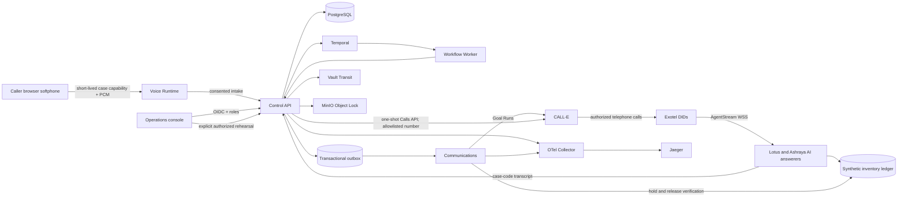

# Architecture And Trust Boundaries

## Authority

PostgreSQL is authoritative for cases, holds, decisions, outbox commands, and transcript artifact metadata. Temporal owns concurrent provider activities, per-hold expiry timers, caller-decision Signals, and release compensation. The browser does not own a decision: it sends a specific hold ID and version using a short-lived session capability. The API rejects stale, expired, or unbound choices. Operator override is separately attributed.

CALL-E Goal Runs are asynchronous. The communications processor stores the public `goal_run_id`, polls authenticated `GET` until `result` or `error`, and never interprets `201` or `call_id` as answered proof. A live hold result must match the case/provider and the answerer’s synthetic inventory reference and expiry. A live release result must match a ledger release. Fixture outbox rows remain labeled **Fixture**.

The separate one-call rehearsal uses CALL-E's Calls API, not the provider Goal Run outbox. The Control API alone holds the allowlisted personal number and API key. Only an OIDC-authenticated operator or supervisor can explicitly start one rehearsal per case; duplicate requests reuse the same idempotency key. Authenticated GET results populate a durable record, and returned CALL-E transcript turns are archived through Vault/MinIO. A completed status without an answering turn and matching spoken demo code is not conversation proof. Rehearsal results do not create holds or Signal Temporal.

## Telephony And Privacy Boundaries

- The caller dialpad is a browser softphone, not a cellular transport. Microphone audio is sent over a case-scoped WebSocket after spoken disclosure and consent. Browser calls suppress legacy caller PSTN callback and SMS commands. `CALLER_CONTACT_MODE` separately gates those commands even when provider CALL-E calls are live.
- Two authorized Exotel numbers route inbound AgentStream PCM to separate AI answerer endpoints. Exotel `start` account SID and DID, plus a strong endpoint token, are checked before answering. The answerers use Deepgram STT and ElevenLabs TTS with a deterministic SQLite demo ledger; they can issue or release only synthetic references. A short spoken case code correlates their transcript to the Doot case without sending a full phone number to the browser.
- Provider-side turns are archived by the Control API using Vault Transit and MinIO Object Lock. Operations transcript reads require an authenticated role and generate an audit access event. CALL-E Goal Runs do not provide these transcript turns; the UI labels the source explicitly.
- Phone maps, provider keys, audio, prompts, transcripts, and model reasoning stay out of the browser and telemetry. OpenTelemetry carries request, trace, case, and route identifiers only.

## Failure Behavior

Safety escalation stops ordinary coordination and schedules hold cleanup. A missing or unverified Goal result never creates a hold. Release failure remains operator-visible, not silently resolved. Live startup rejects placeholder Goal IDs, invalid provider numbers, mismatched published schemas, missing voice configuration, and seeded fixture cases. Authorized number ownership, public TLS routing, and sponsor credentials still require an actual external rehearsal.
